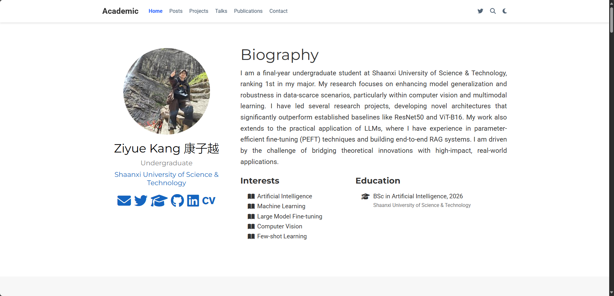

# 康子越的个人学术主页 (Ziyue Kang's Academic Homepage)

该仓库包含我的个人学术主页的全部源代码。

**➡️ 访问在线主页: [https://aibincultars.github.io/](https://aibincultars.github.io/)**

---

## 网站预览

---

## 技术栈

本网站使用 [Hugo](https://gohugo.io/) 静态网站生成器构建，并基于 [Wowchemy](https://wowchemy.com/) 学术主题模板。

所有内容均使用 Markdown 编写，并通过 GitHub Actions 自动部署到 GitHub Pages。
